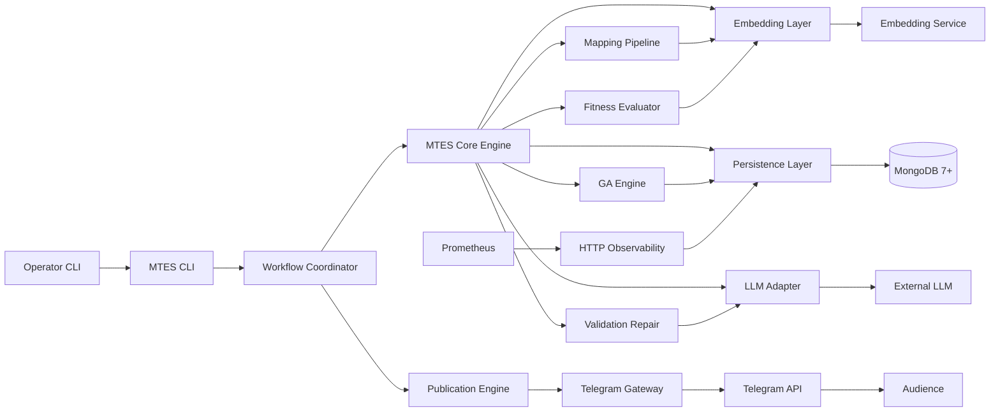

# MTES — Mutation-Traceable Evolutionary Synthesis

**Detailed Design Specification (Technical Contract)**

| Field | Value |
|-------|-------|
| Document type | Detailed design / implementation contract |
| System class | Internal research platform · MVP Greenfield |
| Domain profile | NLP / evolutionary computation · general security (no regulated PHI/PCI scope) |
| Scope | Full MTES MVP: bootstrap, mapping pipeline, GA, LLM phases, persistence, CLI, daemon, Telegram publication, monitoring |
| Out of scope | Multi-tenant SaaS, web admin UI, mobile apps, Kubernetes production, optional P6 judge in MVP, structural/control genes in MVP |
| Version | 1.0 |
| Date | 2026-06-03 |
| Author | Spec Forge (derived from project specifications) |

### Version history

| Version | Date | Author | Changes |
|---------|------|--------|---------|
| 1.0 | 2026-06-03 | Spec Forge | Initial contract from specification set |

---

# SECTION 1 — FOR THE TEAM

## 1.1 Summary (TL;DR)

The project goal is the development of MTES (Mutation-Traceable Evolutionary Synthesis), an automated research platform for short-form text evolution with measurable genotype–phenotype locality. The system targets a single-operator deployment on a Linux VPS, uses Python 3.13+, MongoDB, and external LLM providers as constrained phenotype compilers. Core value is reproducible evolutionary signal—not maximal linguistic creativity. Scope covers specification-compliant implementation from project scaffolding through bootstrap, evolution, Telegram publication, and operational observability. Out of scope: product UI, multi-tenant billing, and engagement optimization as a primary objective.

## 1.2 Context and goals

**Business context.** MTES addresses whether LLM-assisted evolution can preserve locality (small genome changes → small phenotype changes) when the LLM is restricted to surface compilation. Competing approaches treat the LLM as semantic author, which breaks traceability. The project is specification-first with no production code yet.

**System goals (measurable).**

1. Achieve bootstrap `locality_correlation ≥ 0.45` (Spearman) on the golden dataset with `std ≤ 0.05` across calibration runs. [A7 Bootstrap]
2. Sustain `validation_pass_rate ≥ 0.95` and `anchor_integrity ≥ 0.85` during calibration tweet generation. [A7]
3. Run unattended daemon operation with state restoration `< 60 s` and recovery `< 120 s` after restart. [A6 SRS]
4. Expose `GET /health` with `p95 < 1 s` and Prometheus `GET /metrics` including locality and repair gauges. [A6]
5. Preserve 100% genome, phenotype, lineage, and archive traceability per data model acceptance criteria. [A5 Data Model]

**Anti-goals** <span style="color:#C00000">**(mandatory exclusions)**</span>

- The system does **not** maximize engagement, virality, or follower growth as a primary fitness objective.
- The system does **not** use the LLM for dictionary construction, coordinate assignment, or fitness definition.
- The system does **not** ship a web application or end-user onboarding funnel in MVP.
- The system does **not** guarantee uniform phenotype impact per uniform genotype mutation step.
- The system does **not** enter production evolution when bootstrap readiness is `NOT_READY`.

## 1.3 Functional architecture and differentiation

### 1.3.A Three-layer model

| Layer | Criterion | MTES functions |
|-------|-----------|----------------|
| **Differentiating Core** | Remove → product is generic LLM tweet generator | Locality measurement pipeline; deterministic genotype→constraint→plan→compile chain; mutation traceability; constrained compiler routing (P4 families) |
| **Enabling** | Remove → core cannot run | Dictionary + embeddings; MongoDB persistence; bootstrap/calibration; CLI/daemon; provider adapters; validation/repair; GA population loop |
| **Periphery** | Remove → research continues with friction | HTML/JSON reports; Telegram engagement stats; chart trends; verbose/sanitized logging modes |

### 1.3.B Differentiating Core (detail)

**1. Genotype–phenotype locality measurement**

*Description.* Operators and researchers measure Spearman correlation between genotype distance and phenotype distance across golden and live populations.

*Mechanism.* Genotype distance: `0.70 * d_semantic + 0.30 * d_numeric` (GA Spec §7.3). Phenotype distance: `0.60 * embedding_distance + 0.25 * stylometric_delta + 0.15 * constraint_deviation` (Mapping Spec §12). Pairwise Spearman on full golden set; embeddings cached per calibration run.

*Why it works.* Competing pipelines optimize text quality without a joint metric; MTES makes locality a gate for provider selection and production readiness (`≥ 0.45`).

*Key risk.* Embedding or dictionary version drift collapses correlation. *Mitigation:* versioned `dictionary_version`, `mapping_version`, `embedding_model_id`; recalibration matrix on change (Bootstrap §18).

**2. Deterministic upstream mapping**

*Description.* Semantic expansion, anchors, relation graph, and structural plan are computed without LLM stochasticity.

*Mechanism.* Fixed models: `sentence-transformers/all-mpnet-base-v2` for expansion; edge score `0.50*cosine + 0.30*polarity_alignment + 0.20*rarity`; rhetorical/sentiment lookup tables; `tiktoken cl100k_base` tokenization.

*Why it works.* Stochastic planning would confound mutation attribution; competitors mix planning and generation in one LLM call.

*Key risk.* Heuristic axes are not independent latent semantics (`|r| < 0.50` monitored). *Mitigation:* axis correlation warnings; bucket purity `≥ 0.70`.

**3. Constrained LLM compilation (P3–P5)**

*Description.* LLM expands constraints (P3), compiles one phenotype (P4), expands five candidates (P5); routing by gene activation with hysteresis.

*Mechanism.* Decoding profiles per phase (LLM Spec §5); prompt families P4-A…F with `activation_threshold = 0.70`; validation order `required > prohibited > target`.

*Why it works.* Separates search space (genome) from surface realization; enables repair and anchor integrity gates before selection.

*Key risk.* Repair leakage (`mean_repair_penalty > 0.08` for 3 windows). *Mitigation:* diagnostic-first recovery; hard reject `anchor_integrity < 0.70`.

**4. Mutation traceability**

*Description.* Every genome links to parents, mutation log, and archived phenotypes with generation snapshots.

*Mechanism.* Append-only `genomes`, `mutation_history`, `tweet_archive`, `audit_log`; seed `hash(genome_id + generation_id)`.

*Why it works.* Research requires lineage reconstruction, not black-box generations.

*Key risk.* Storage growth without eviction policy in data model. *Mitigation:* archive eviction per genetic spec (implementation follows GA archive policies); temp collections TTL ≥ 90 days.

### 1.3.C Enabling (compact)

- Bootstrap pipeline (14 sequential stages) with idempotent `mtes bootstrap`
- Dictionary construction (5k–50k source pool; MVP active vocabulary 2k–3k tokens per GA)
- Embedding layer with in-memory cosine retrieval over stored embeddings
- Evolution lifecycle FSM (CREATED→RUNNING→…)
- Workflow coordinator with persisted state and recovery
- Global rate limiter across LLM/Telegram providers
- Fitness evaluation (post-repair for selection; pre-repair for diagnostics)
- Telegram Gateway (publish, stats, operator commands)
- Configuration (YAML), secrets via environment
- Maintenance worker (archive/index/cleanup/engagement sync)

### 1.3.D Periphery (compact)

- `mtes report` HTML + JSON (+ optional CSV)
- Prometheus counters/gauges and provider info metric
- Trial publication observation window (7+ days)
- Makefile convenience targets
- Windows/PowerShell support notes (Linux recommended for production)

### 1.3.E Comparison (Differentiating Core criteria)

| Criterion | MTES | Generic LLM tweet bot | Prompt-only GA | Rule-based generator |
|-----------|------|----------------------|----------------|---------------------|
| Locality metric (Spearman genotype↔phenotype) | Mandatory bootstrap gate | Not measured | Ad hoc | N/A (no genotype) |
| Deterministic planning before LLM | Full pipeline | Rare | Partial | Full (no LLM) |
| Mutation lineage in DB | Append-only audit | None | Varies | None |
| LLM role | Compiler only | Author | Author | None |
| Reproducibility record | Bootstrap report + versions | Low | Low | High (low quality) |

*Segment adaptation:* Internal-tool comparison (vs. manual experimentation in notebooks/scripts).

## 1.4 Users and roles

| Role | Who | Actions | Key permissions |
|------|-----|---------|-----------------|
| **Research operator** | Human running VPS deployment | bootstrap, evolution control, reset, approve borderline bootstrap | pause/resume/stop/reset (authenticated); approve `READY_WITH_WARNINGS` |
| **System** | Daemons, workers, webhooks | generation, validation, publication, metrics | full internal pipelines; no destructive reset without operator |
| **Telegram subscriber** | Channel audience | read published tweets | none on control plane |

*Note:* No multi-role RBAC matrix in MVP—operator authentication via allow-listed Telegram user IDs and/or environment secrets (Architecture §13.4, SRS §17.4).

## 1.5 Key user scenarios

**Scenario 1: Cold start bootstrap**

Operator runs `mtes bootstrap` on configured VPS → infrastructure and provider validation → dictionary and embeddings → golden dataset/prompts → locality calibration → population init → Telegram trial publications → readiness `READY` or `READY_WITH_WARNINGS` with documented approval.

**Scenario 2: Single phenotype generation (evolution paused)**

Operator runs `mtes generate --count 5 --json` → pipeline executes P3–P5 for each genome → validation/repair → results persisted → stdout JSON with fitness and anchor integrity; evolution state unchanged.

**Scenario 3: Production evolution daemon**

Operator starts daemon → evolution `RUNNING` → bounded worker pool processes generations → locality gauge updated per `locality_measurement_interval` → publications queued to Telegram → on SIGTERM, current cycle completes, state flushed.

**Scenario 4: Operational incident**

Provider failure → failover primary→secondary→fallback → if persistent, workflow pauses → operator receives Telegram status → `mtes evolution pause` or emergency stop → logs and `system_events` record `PROVIDER_FAILOVER`.

**Scenario 5: Controlled evolution reset**

Operator runs `mtes evolution reset --confirm` → generation counter reset, new population, archives and publication history preserved → audit log records operator and timestamp.

## 1.6 Non-functional requirements

| Category | Requirement | Metric |
|----------|-------------|--------|
| Performance | Technical bootstrap | Wall clock `< 60 min` (excludes 7-day trial publication) [A6] |
| Performance | Single generation | `< 60 s` recommended (provider-dependent) [A6] |
| Performance | Health endpoint | Response `< 1 s`, read-only [A6] |
| Performance | Report generation | `< 5 min` recommended [A6] |
| Availability | Daemon recovery after crash | State restore `< 60 s`; full recovery `< 120 s` [A6] |
| Scalability | MVP deployment | Single VPS instance; bounded queues (`generation_queue_size`, `publication_queue_size` default 100) [A6] |
| Security | Secrets | Never in source; env/secret injection [A4] |
| Security | Operator commands | Authenticated; audit logged [A6] |
| Observability | Logging | Structured JSON Lines recommended; correlation fields [AGENTS] |
| Observability | Metrics | Prometheus text at `GET /metrics`; locality not every generation [A6] |
| Research integrity | Locality stability | `std(locality_correlation) ≤ 0.05` across calibration runs [A7] |

## 1.7 Release plan

| Release | Content | Ready when |
|---------|---------|------------|
| **MVP-0** | Project skeleton, config, persistence repositories, health/metrics HTTP, MongoDB connectivity | `GET /health` returns `healthy` with DB check |
| **MVP-1** | Dictionary, embeddings, translation/mapping pipeline (no LLM), unit tests for metrics | Golden dataset distances reproducible |
| **MVP-2** | LLM adapter P3–P5, validation, repair, fitness | `mtes generate` succeeds with anchor integrity ≥ 0.85 on sample |
| **MVP-3** | Bootstrap command, calibration, bootstrap report collection | Bootstrap reaches `READY` or documented `READY_WITH_WARNINGS` |
| **MVP-4** | GA loop, evolution FSM, CLI evolution commands | `mtes evolution status` accurate; pause at cycle boundary |
| **MVP-5** | Daemon scheduler, publication engine, Telegram gateway | Trial publications ≥ 99% success in bootstrap window |
| **MVP-6** | Reports, maintenance worker, full acceptance checklist (SRS §20) | All SRS acceptance criteria pass |

## 1.8 Risks

| Risk | P | I | Mitigation |
|------|---|---|------------|
| Locality below 0.45 after provider change | M | H | Recalibration matrix; block production start |
| Repair leakage dominates fitness | M | H | Diagnostic-first recovery; monitor `mtes_repair_rate` |
| MongoDB outage | L | H | Workflow pause; emergency stop; retry 1s/2s/4s |
| Dictionary/GA vocabulary mismatch | M | M | Treat GA 2k–3k as active subset of bootstrap pool |
| Mapping v5.0 vs GA gene count drift | M | M | MVP ships 6 numeric genes; defer `question_probability` |
| Single-instance workflow race | L | M | Document single-instance constraint; no distributed lock in MVP |
| Telegram API rate limits | M | L | 30 msg/min default throttle |
| Embedding cost at calibration scale | M | M | Cache embeddings; forbid re-embed in pairwise loop |
| Operator error on hard reset | L | H | `--confirm` + audit log + separate `--hard-reset` |

## 1.9 Assumptions

- ✓ Production database: MongoDB 7+ (self-hosted, Docker, or managed MongoDB without Atlas Search). `[scope: persistence]`
- ✓ Cache layer optional at runtime; bootstrap infrastructure check validates cache only when configured. `[scope: bootstrap]`
- ~ `bootstrap_reports`, `workflow_state`, `population_state`, `publication_queue` collections: required by SRS/Architecture but absent from Data Model v1.0—schemas defined in Section 2.3 of this document. `[assumed]`
- ✓ Active MVP vocabulary 2,000–3,000 tokens (GA) drawn from larger bootstrap dictionary pool (5,000+). `[scope: dictionary]`
- ✓ MVP numeric genes: exactly six per GA; `question_probability` from Mapping v5.0 deferred. `[scope: genetics]`
- ✓ Fitness formula: Mapping Spec v5.0 final decomposition for selection. `[scope: fitness]`
- ✓ No web UI; CLI + HTTP health/metrics only. `[scope: interfaces]`
- ⚠ README documentation paths (`docs/Architecture.md`, etc.) do not match repository filenames—this document uses actual paths. `[A1 vs repo]`

## 1.10 Source conflicts

| Conflict | Source | Resolution | Rationale |
|----------|--------|------------|-----------|
| README doc paths vs actual files | A1 README vs repo | Use `docs/*_specification.md` names | Repository is source of truth for paths |
| MongoDB deployment vs localhost in SRS example | A4 Architecture vs A6 SRS | MongoDB 7+ for production; localhost for dev in `config.yaml` | Architecture deployment target; SRS shows dev ergonomics |
| Bootstrap requires cache vs Architecture optional cache | A7 Bootstrap §5.2 vs A4 §7.12 | Validate cache if configured; system runs without cache | Fault isolation: optional cache |
| Bootstrap dictionary min 5,000 vs GA MVP 2,000–3,000 active | A7 §7.3 vs A3 GA §5.1 | Pool ≥ 5k; active evolutionary vocabulary 2k–3k | Pool vs active subset |
| Mapping v5.0 adds `question_probability` vs GA "exactly six numeric genes" | A2 Mapping v5.0 vs A3 GA §3.1 | MVP: six genes only; question_probability post-MVP | GA explicit MVP baseline |
| Fitness v1.1 vs v5.0 decomposition | A2 Mapping §11 vs v5.0 §7 | Use v5.0 formula with `readability_floor` and `repair_cost_penalty` | Later clarification in same spec |
| `bootstrap_reports` collection | A7 §17.2 vs A5 Data Model | Define collection in implementation; Data Model update tracked | Bootstrap authoritative until model updated |
| Relation tension condition §7.3 vs v5.0 §3 | A2 §7.3 vs v5.0 | Use v5.0 ordered evaluation including `distant` | Explicit ordering resolves overlap |
| Edge score uses `polarity_delta` name in §7.1 vs `polarity_alignment` in v5.0 | A2 §7.1 vs v5.0 §5 | Use `polarity_alignment` | v5.0 rename |

If no further conflicts: **additional conflicts may appear during implementation; resolve via specification hierarchy (T3 code > T2 specs > T1 README).**

## 1.11 Prioritization

No author color/MVP tags in source specifications beyond implicit MVP labels in genetic and mapping specs. FR tables use implicit priority: bootstrap and locality gates are **P0**; Periphery features **P2**.

## 1.12 Architectural forks

### Fork 1: Deployment database

*Context:* Persist genomes, vectors, and workflow state.

*Chosen:* MongoDB 7+ on VPS (Docker) with in-memory cosine retrieval; no Atlas Search features.

*Alternatives:*
- Managed MongoDB without Atlas Search — acceptable if wire protocol compatible
- PostgreSQL + pgvector — rejected: spec mandates MongoDB collections

*Risks:* MongoDB network latency; mitigated by connection pooling, retry policy, and bounded in-memory corpus loads.

### Fork 2: MVP LLM compiler

*Context:* P4 compilation with structured JSON output.

*Chosen:* `mistralai/Mistral-7B-Instruct-v0.2` (local or hosted) per Mapping Spec; OpenAI/Anthropic via adapter for bootstrap provider scoring.

*Alternatives:*
- GPT-4 only — rejected: cost and locality variability for calibration volume
- Pure local 7B without cloud fallback — rejected: bootstrap provider validation needs reliable cloud option

*Risks:* Local GPU optional; CPU inference may exceed 60 s target.

### Fork 3: Process architecture

*Context:* Long-running evolution on VPS.

*Chosen:* Docker Compose: Core (CLI+daemon+HTTP), Publication Worker, Maintenance Worker; asyncio coroutines with `Semaphore` bounds.

*Alternatives:*
- Kubernetes — rejected: YAGNI for MVP single instance
- Celery/RabbitMQ — rejected: Architecture avoids external broker

*Risks:* Single-instance coordinator; scale-out needs distributed locking (post-MVP).

### Fork 4: Operator interface

*Context:* Control evolution and view status.

*Chosen:* CLI primary; Telegram for publication and authenticated operator commands.

*Alternatives:*
- Web dashboard — rejected: out of scope
- CLI only (no Telegram inbound) — rejected: SRS and Architecture require Telegram operator path

*Risks:* Telegram auth misconfiguration exposes commands; mitigated by allow-lists.

---

# SECTION 2 — FOR IMPLEMENTATION

## 2.1 System context

The development target is creation of MTES, a Python 3.13 asyncio research platform that evolves short text phenotypes from structured genomes with measurable locality. Primary consumers are a research operator (CLI/Telegram) and internal automation (daemon, workers). The stack is Python, MongoDB 7+, Docker Compose on Linux VPS, LLM and embedding provider adapters, sentence-transformers/spaCy/tiktoken for deterministic metrics, and Prometheus-compatible monitoring. Out of scope: web UI, multi-tenant isolation, and engagement-maximizing optimization. System class: internal research platform, MVP greenfield, event/async workflow driven with CLI surface.

## 2.1.1 System architecture (C4 Container)

| Component | Type | Technology | Incoming | Outgoing |
|-----------|------|------------|----------|----------|
| Research Operator | Person | CLI / shell | — | → MTES CLI (stdio) |
| Telegram Operator | Person | Telegram client | — | → Telegram API |
| Channel Audience | Person | Telegram client | ← Telegram API | — |
| MTES CLI | Application | Python 3.13 (Typer/Click) | ← Operator | → Core Engine, Persistence, HTTP server |
| HTTP Observability | Application | Python (aiohttp/uvicorn) | ← Prometheus scraper | → Persistence (read-only status) |
| Workflow Coordinator | Backend | Python asyncio | ← CLI, Daemon, Telegram Gateway | → Core Engine, Persistence |
| MTES Core Engine | Backend | Python asyncio | ← Workflow Coordinator | → Mapping, GA, LLM Adapter, Embedding, Persistence |
| Mapping Pipeline | Backend | Python (deterministic) | ← Core Engine | → Embedding Layer, Persistence |
| GA Engine | Backend | Python | ← Core Engine | → Persistence |
| LLM Adapter Layer | Backend | Python | ← Core Engine | → External LLM APIs (HTTPS) |
| Embedding Layer | Backend | Python | ← Core Engine, Mapping | → External/local embedding (HTTPS/local), Persistence |
| Validation & Repair | Backend | Python | ← Core Engine | → LLM Adapter (repair), Persistence |
| Fitness Evaluator | Backend | Python | ← Core Engine | → Embedding Layer, Persistence |
| Publication Engine | Backend | Python asyncio | ← Workflow Coordinator, Daemon | → Telegram Gateway, Persistence |
| Telegram Gateway | Adapter | Python (python-telegram-bot/grammy pattern) | ← Telegram API (webhook/poll) | → Publication Engine signals, Workflow Coordinator, Monitoring |
| Persistence Layer | Backend | Python (Motor/pymongo async) | ← All internal services | → MongoDB 7+ |
| MongoDB | Database | MongoDB 7+ | ← Persistence | — |
| Global Rate Limiter | Infrastructure | Python asyncio | ← LLM, Telegram, Embedding adapters | — |
| Maintenance Worker | Worker | Python asyncio / container | ← Scheduler | → Persistence, Telegram Gateway, Embedding |
| Prometheus | External | Scraping | ← HTTP Observability GET /metrics | — |
| External LLM Provider | External | OpenAI/Anthropic/OpenRouter/local | ← LLM Adapter | — |
| External Embedding Provider | External | API or local model | ← Embedding Layer | — |



## 2.2 Design tokens (UX / Layout)

Not applicable. MTES MVP has no web or mobile UI. CLI and JSON/human stdout only. Recorded in assumptions: «Design tokens skipped—API/CLI-only system.»

## 2.3 Data model

### 2.3.1 Global rules (from Data Model Spec)

All core documents include: `schema_version`, `experiment_id`, `run_id`, `created_at`. Immutable append-only: `genomes`, `mutation_history`, `candidate_archive`, `validation_records`, `fitness_records`, `tweet_archive`, `audit_log`. Embeddings stored on documents; cosine similarity computed in-memory; `embedding_models.dimension` required for validation.

### 2.3.2 Specification collections (summary)

| Entity | Key fields | Notes |
|--------|------------|-------|
| dictionary_terms | token, coordinate[5], bucket_id, embedding, dictionary_version | token UNIQUE |
| dictionary_buckets | coordinate, term_count | coordinate UNIQUE |
| pair_memory_state | genome_id_a < genome_id_b, use_count, current_penalty | UNIQUE pair |
| constraint_records | genome_id, constraint_set, mapping_version | TTL ≥ 90d |
| genomes | semantic_genes, numeric_genes, parent_ids, seed, versions | anchor frozen at creation |
| mutation_history | genome_id, mutation_log, crossover_type | lineage |
| phenotype_candidates | genome_id, text, routing_family, validation_status | TTL ≥ 90d |
| candidate_archive | scores, selected, embedding | P5 output |
| validation_records | passes, failed_checks, repair_attempts | |
| fitness_records | fitness, novelty, distances, formula_version | candidate-level |
| tweet_archive | text, generation_snapshot, embedding, evicted | published output |
| embedding_models | dimension, distance_metric | required before in-memory retrieval validation |
| audit_log | event_type, details | LLM/validation/archive events |
| system_events | severity, event_type, message | infra lifecycle |

### 2.3.3 Operational collections [assumed]

| Entity | Field | Type | Required | Relation |
|--------|-------|------|----------|----------|
| bootstrap_reports | bootstrap_version | string | ✓ | — |
| bootstrap_reports | readiness_status | enum READY/READY_WITH_WARNINGS/NOT_READY | ✓ | — |
| bootstrap_reports | reproducibility_record | object | ✓ | per Bootstrap §20 |
| bootstrap_reports | operator_approval | bool | — | — |
| workflow_state | workflow_id | string | ✓ | UNIQUE |
| workflow_state | state | string | ✓ | FSM state |
| workflow_state | stage | string | ✓ | current stage |
| workflow_state | retry_count | int | ✓ | — |
| workflow_state | updated_at | datetime | ✓ | — |
| evolution_state | status | enum | ✓ | CREATED…FAILED |
| evolution_state | generation_number | int | ✓ | — |
| evolution_state | population_size | int | ✓ | — |
| evolution_state | paused_at_cycle | bool | ✓ | — |
| population_members | genome_id | string | ✓ | N:1 population |
| population_members | fitness_rank | float | — | — |
| publication_queue | candidate_id | string | ✓ | — |
| publication_queue | scheduled_at | datetime | — | — |
| publication_queue | status | enum pending/sent/failed | ✓ | — |
| daemon_state | active_schedules | array | ✓ | — |
| daemon_state | queue_depths | object | ✓ | — |

### 2.3.4 Genome document (canonical)

| Field | Type | Required | Note |
|-------|------|----------|------|
| semantic_genes[].coordinate | int[5] | ✓ | each axis 0–7 |
| semantic_genes[].anchor | string | ✓ | resolved at creation |
| numeric_genes.* | float | ✓ | six genes, LUT from byte |
| parent_ids | string[] | — | empty for initial |
| seed | int | ✓ | hash policy |
| dictionary_version | string | ✓ | |
| mapping_version | string | ✓ | |

## 2.4 Functional requirements

### Bootstrap

- FR-bootstrap.01 [scope: bootstrap]: The system executes bootstrap stages sequentially; a stage does not start until the previous stage completes successfully.
- FR-bootstrap.02 [scope: bootstrap]: The system persists a bootstrap report to `bootstrap_reports` with `reproducibility_record` per Bootstrap §20.
- FR-bootstrap.03 [scope: bootstrap]: The system blocks production evolution start when readiness is `NOT_READY`.
- FR-bootstrap.04 [scope: bootstrap]: The system requires operator approval recorded when readiness is `READY_WITH_WARNINGS` (locality borderline 0.45–0.50).

### Mapping / translation

- FR-mapping.01 [scope: mapping]: The system converts six numeric genes to constraints via deterministic translation without stochastic sampling.
- FR-mapping.02 [scope: mapping]: The system maps `compression_target` to token limits 48/36/24 per Mapping §4.3.
- FR-mapping.03 [scope: mapping]: The system computes `edge_score = 0.50*cosine_similarity + 0.30*polarity_alignment + 0.20*rarity_score`.
- FR-mapping.04 [scope: mapping]: The system assigns relation types using v5.0 ordered rules ending in `distant`.
- FR-mapping.05 [scope: mapping]: The system sets `anchor_similarity_threshold = 0.82 + anchor_rigidity * 0.14`.
- FR-mapping.06 [scope: mapping]: The system rejects candidates with `anchor_integrity < 0.70`.

### LLM interaction

- FR-llm.01 [scope: llm]: The system prohibits LLM usage in dictionary construction (P1) and mapping construction (P2).
- FR-llm.02 [scope: llm]: The system executes P3→P3 validation→P4→validation→optional repair→P5 (5 candidates) per pipeline overview.
- FR-llm.03 [scope: llm]: The system routes P4 prompt family when `activation_score >= 0.70` with hysteresis `+0.10`.
- FR-llm.04 [scope: llm]: The system applies decoding profiles: P3 temp 0.20; P4 0.60; P5 0.80; P6 0.00 when used.
- FR-llm.05 [scope: llm]: The system logs all prompt family and candidate count changes to audit_log.

### Genetic algorithm

- FR-ga.01 [scope: ga]: The system applies semantic mutation as ±1 axis step with reflection at boundaries 0 and 7.
- FR-ga.02 [scope: ga]: The system allocates parent pools 70% exploitation / 20% novelty / 10% exploration.
- FR-ga.03 [scope: ga]: The system performs crossover with 40/40/20 blend per semantic gene and canonical parent ordering by genome id.
- FR-ga.04 [scope: ga]: The system triggers locality repair when offspring distance > 0.35, max 3 iterations on semantic genes only.
- FR-ga.05 [scope: ga]: The system records mutation_history for every new genome.

### Evolution control

- FR-evolution.01 [scope: evolution]: The system enforces evolution FSM transitions per SRS §7.2 only.
- FR-evolution.02 [scope: evolution]: The system enters PAUSED only at evolutionary cycle boundaries; no partial cycles persist.
- FR-evolution.03 [scope: evolution]: The system requires authentication for pause, resume, stop, reset commands.
- FR-evolution.04 [scope: evolution]: The system implements standard reset preserving archives and publication history; hard reset removes archives and metrics with `--hard-reset --confirm`.

### Generation (non-evolution)

- FR-generate.01 [scope: generate]: The system runs `mtes generate` without incrementing evolution generation counter.
- FR-generate.02 [scope: generate]: The system supports batch up to 100 with partial failure tolerance per SRS §6.4.

### Telegram / publication

- FR-telegram.01 [scope: telegram]: The system throttles outbound messages to 30 per minute by default.
- FR-telegram.02 [scope: telegram]: The system supports immediate and scheduled publication via internal scheduler.
- FR-telegram.03 [scope: telegram]: The system collects engagement metrics when available without using engagement as fitness.

### Persistence / observability

- FR-persist.01 [scope: persistence]: The system uses append-only semantics for immutable collections; corrections create new documents.
- FR-persist.02 [scope: persistence]: The system exposes `GET /health` with status healthy/degraded/unhealthy within 1 second.
- FR-persist.03 [scope: metrics]: The system exposes Prometheus metrics including `mtes_locality_correlation` updated per configured interval, not every generation.
- FR-persist.04 [scope: logging]: The system writes audit records for administrative commands with operator, timestamp, command, result.

### Daemon

- FR-daemon.01 [scope: daemon]: The system bounds worker pools and queues per configuration; delays new jobs when queues exceed limits.
- FR-daemon.02 [scope: daemon]: The system on SIGTERM/SIGINT stops scheduling, completes active evolutionary cycle, flushes logs, persists state, closes DB connections.

## 2.5 State machines

**Entity: Evolution lifecycle**

| From → To | Condition | Actor | Side effects |
|-----------|-----------|-------|--------------|
| CREATED → RUNNING | operator start or bootstrap complete | operator/system | begin scheduling cycles |
| RUNNING → PAUSED | pause at cycle boundary | operator | stop new cycles |
| RUNNING → STOPPING | stop requested | operator | finish active cycle |
| RUNNING → FAILED | unrecoverable error | system | alert; log CRITICAL |
| PAUSED → RUNNING | resume | operator | next cycle scheduled |
| PAUSED → STOPPING | stop | operator | — |
| STOPPING → STOPPED | cycle complete | system | clear active work |
| STOPPED → RUNNING | restart | operator | — |
| STOPPED → RESETTING | reset requested | operator | audit log |
| RESETTING → CREATED | reset complete | system | new population per reset mode |
| FAILED → RUNNING | {forbidden without manual recovery} | — | 422 |
| any → FAILED | {operator recovery path via stop/reset only} | operator | documented runbook |

**Entity: Publication queue item**

| From → To | Condition | Actor | Side effects |
|-----------|-----------|-------|--------------|
| pending → sent | Telegram API success | system | tweet_archive link |
| pending → failed | API error after retries | system | retry or DLQ log |
| sent → {forbidden} | — | — | append-only |
| failed → pending | operator retry | operator | audit |

**Entity: Bootstrap stage**

Sequential pipeline; failure in any stage sets `NOT_READY` and aborts downstream stages.

## 2.6 Destructive operation cascades

| Entity | Action | Pre-checks | Dependents | UI/CLI behavior |
|--------|--------|------------|------------|-----------------|
| Evolution | standard reset | `--confirm`; auth | generation counter reset; new population; archives kept | confirm flag required |
| Evolution | hard reset | `--hard-reset --confirm`; auth | removes archives, population, historical metrics | double confirm |
| tweet_archive | evicted flag | eviction policy met | embedding retained; evicted=true | no hard delete in MVP |
| phenotype_candidates | TTL purge | age > 90d | none referenced by selection | maintenance job |
| constraint_records | TTL purge | age > 90d | — | maintenance job |
| User/operator | N/A | — | — | no end-user accounts in MVP |

## 2.7 Notification registry

| Trigger | Recipient | Channel | Content | Disable |
|---------|-----------|---------|---------|---------|
| Bootstrap FAILED | operator | Telegram + log | stage name, error code | no |
| Evolution FAILED | operator | Telegram | status, last generation | no |
| READY_WITH_WARNINGS | operator | CLI report | locality value, approval required | no |
| Publication sent | channel audience | Telegram | phenotype text | n/a |
| Provider failover | operator | log + system_events | secondary provider name | no |
| Subscription/scheduling | — | — | not applicable MVP | — |

*Applicability:* users + async events present; Telegram is primary channel.

## 2.8 API and HTTP endpoints

MTES MVP exposes operational HTTP only (no public REST CRUD for genomes).

```
GET /health  — Returns JSON status, evolution_status, queue_depth, active_workers, timestamps. Returns: {status, evolution_status, ...}.
GET /metrics — Returns Prometheus text exposition format including mtes_* counters and gauges.
```

CLI commands (primary interface)—see SRS §16; implementation provides Typer entry `mtes` with subcommands bootstrap, generate, evolution, telegram, report, global flags `--config`, `--json`, `--verbose`, `--verbose-sanitized`.

## 2.9 Screens and navigation

Not applicable (no UI).

## 2.10 User flows

**Flow: Bootstrap to production**

| # | Actor | Action | API | System |
|---|-------|--------|-----|--------|
| 1 | Operator | Runs `mtes bootstrap` | CLI | Sequential stages execute |
| 2 | System | — | — | Writes bootstrap_report |
| 3 | System | — | — | Sets readiness READY or READY_WITH_WARNINGS |
| ↳ alt: | Operator | Locality 0.45–0.50 | — | Approval recorded in report |
| 4 | Operator | Starts daemon / evolution | `mtes evolution resume` | State RUNNING |

**Flow: Single generation**

| # | Actor | Action | API | System |
|---|-------|--------|-----|--------|
| 1 | Operator | `mtes generate --json` | CLI | Loads genome from population or sample |
| 2 | System | — | internal | P3–P5 pipeline |
| 3 | System | — | — | Persists candidates, validation, fitness |
| 4 | System | — | stdout JSON | Returns text, fitness, anchor_integrity |

**Flow: Graceful shutdown**

| # | Actor | Action | API | System |
|---|-------|--------|-----|--------|
| 1 | Operator | SIGTERM to daemon | — | Stop scheduling |
| 2 | System | — | — | Completes current evolutionary cycle |
| 3 | System | — | — | Persists daemon and evolution state |
| 4 | System | — | — | Closes MongoDB connections; exit 0 |

## 2.11 Stack and components

| Layer | Technology | Rationale |
|-------|------------|-----------|
| Language | Python 3.13+ | Spec mandate |
| Async | asyncio + Motor | Async-first architecture |
| CLI | Typer | Typed CLI, `--json` support |
| HTTP | uvicorn + Starlette/FastAPI | Lightweight health/metrics |
| Database | MongoDB 7+ | Document store + standard B-tree indexes |
| Embeddings | sentence-transformers / provider API | Mapping + in-memory cosine retrieval |
| NLP metrics | spaCy `en_core_web_sm`, tiktoken | Anchor + tokenization |
| LLM | Provider adapters (OpenAI, Anthropic, local) | Provider independence |
| Telegram | python-telegram-bot or aiogram | Gateway isolation |
| Scheduling | APScheduler or asyncio | SRS embedded scheduler |
| Containers | Docker Compose | VPS deployment |
| CI | pytest, ruff/mypy | AGENTS.md quality |
| Observability | prometheus_client, structlog | SRS metrics + structured logs |
| CPU-heavy | ProcessPoolExecutor via run_in_executor | Locality pairwise, population fitness |

---

# APPENDIX A — Module layout (implementation)

```text
src/mtes/
  core/           # workflow coordinator, core engine
  mapping/        # translation, anchors, relation graph, structural plan
  ga/             # mutation, crossover, selection
  llm/            # adapters, P3–P7, routing
  persistence/    # repositories, MongoDB
  publication/    # publication engine
  telegram/       # gateway
  monitoring/     # metrics, health, logging
  shared/         # types, config, rate limiter
tests/unit/
tests/integration/
config/
docker/
```

---

# APPENDIX B — Traceability index

| Artifact ID | Source | Role |
|-------------|--------|------|
| A1 | README.md | Context, intended CLI examples (non-normative paths) |
| A2 | docs/genotype_phenotype_mapping_specification.md | Mapping, fitness, metrics |
| A3 | docs/genetic_encoding_and_evolution_specification.md | GA, genome, operators |
| A4 | docs/architecture_specification.md | Modules, deployment, boundaries |
| A5 | docs/data_model_specification.md | MongoDB schemas |
| A6 | docs/software_requirements_specification.md | CLI, daemon, NFR, acceptance |
| A7 | docs/bootstrap_specification.md | Bootstrap pipeline, calibration |
| A8 | docs/llm_interaction_specification.md | LLM phases, routing, decoding |
| AG | AGENTS.md | Engineering conventions for implementation |

---

*End of detailed design contract.*
